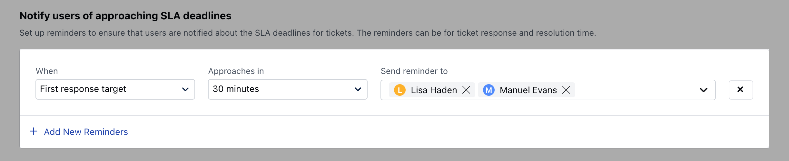
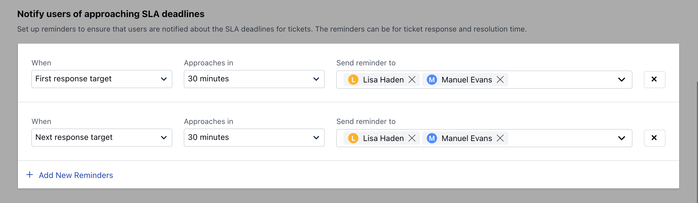
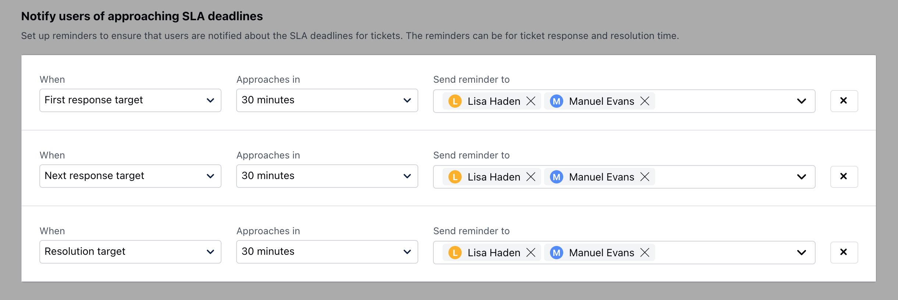
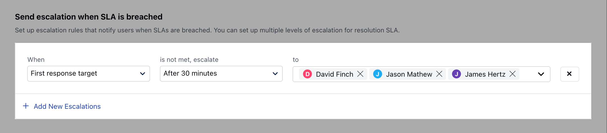
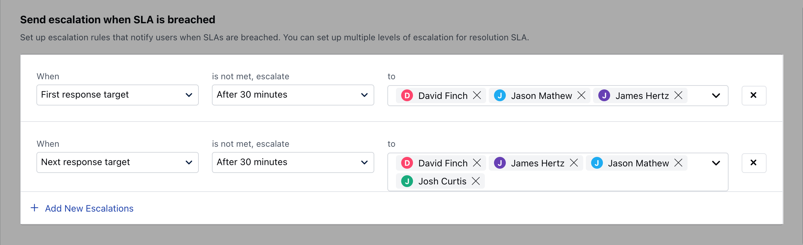
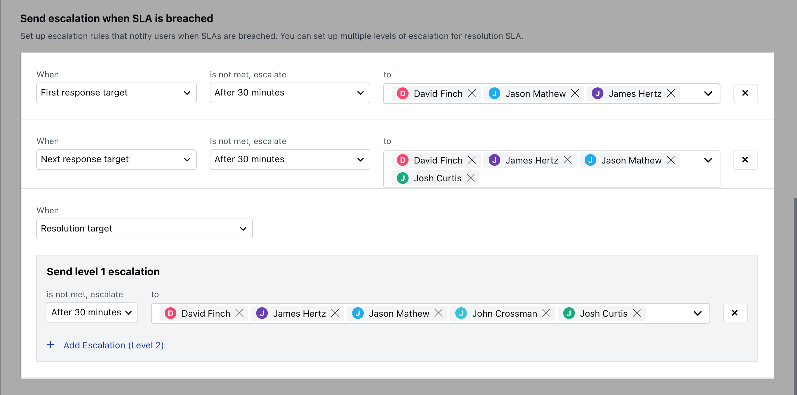

###  SLA Reminders

SLA reminders play a crucial role in proactively notifying the relevant user or team member as a ticket approaches its Service Level Agreement (SLA) deadline.

Types of SLA Reminders

- [First Response Target](#first-response-target)

- [Next Response Target](#next-response-target)

- [Resolution Response Target](#resolution-response-target)

###  First Response Target 

- Specify the time duration within which a selected User/Team should receive a reminder prompting them to respond as the First Response Time approaches, ensuring proactive engagement and adherence to service level commitments.

###  Next Response Target 

- Select the specific time window during which a selected User/Team will receive reminders prompting them to send a reply when the next response time is approaching, ensuring timely and proactive engagement in adherence to response time commitments.

###  Resolution Response Target

- Select the time duration within which a selected User/Team should receive reminders prompting them to send a reply when the Resolution Time is approaching, ensuring timely and proactive engagement in adherence to resolution time commitments.

###  SLA Escalations

If a ticket surpasses its SLA, the escalation rules come into effect, promptly notifying the appropriate users. This proactive approach allows you to take swift action, ensuring that any concerns raised by your customers are addressed promptly, thereby upholding our commitment to providing efficient and responsive customer support.

Types of SLA Escalations

- [First Response Target](#first-response-target)

- [Next Response Target](#next-response-target)

- [Resolution Response Target](#resolution-response-target)

###  First Response Target

- Define the time frame during which a specific User/Team will receive an alert in the event that the First Response Time is violated, facilitating prompt awareness and corrective action to uphold service-level commitments.

###  Next Response Target

- Specify the timeframe within which a specific User/Team will receive an alert in the event that the Next Response Time is violated, ensuring timely awareness and enabling swift corrective action to uphold service-level commitments.

###  Resolution Response Target

- Define the specific time window during which an assigned User/Team will be alerted if the Resolution Time is exceeded, ensuring they are promptly informed and enabling quick corrective actions to maintain adherence to service-level commitments.

