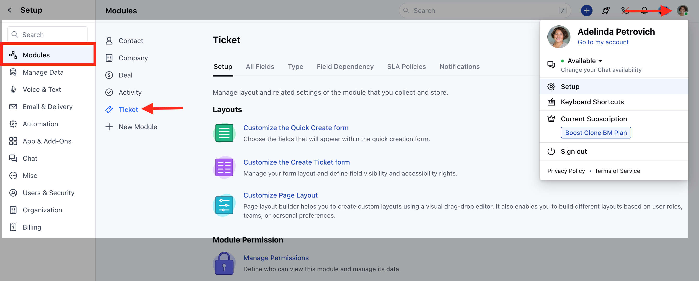
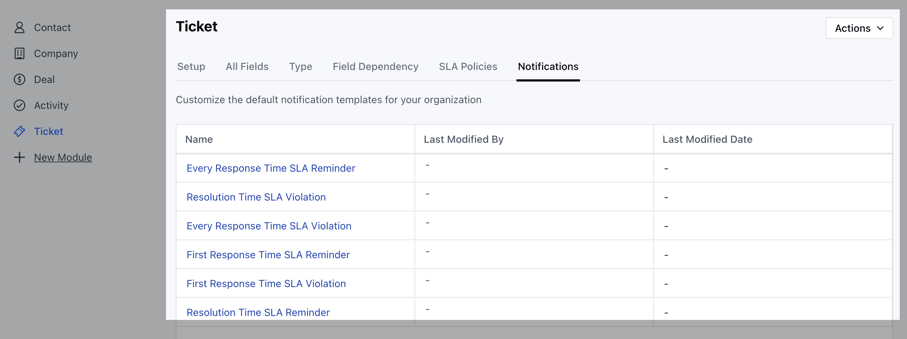
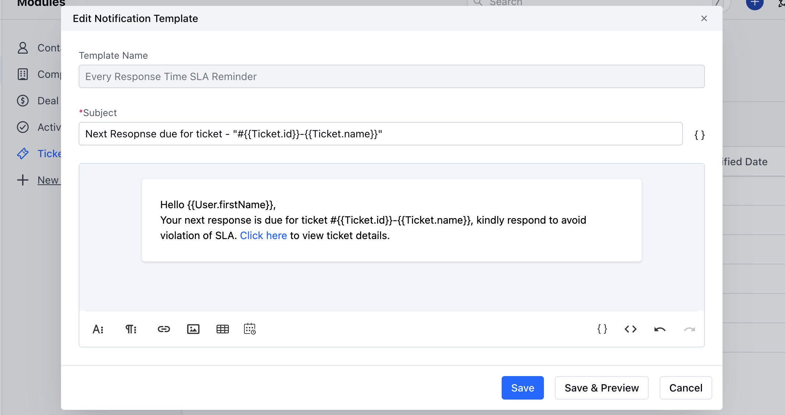

Salesmate provides users with the flexibility to personalize their Ticket Notification Templates according to their specific needs.

To Customize the Ticket Notification Templates,

*   Navigate to the **Profile Icon** on the top right corner
*   Click on the **Set Up**
*   Head over to the **Modules** category
*   Click on the **Ticket** module

*   Head to the **Notifications** section
*   You will the List of the **Notification Templates**

*   Select the preferred Template
*   A popup will appear which allows you to customize the following:
    *   **Subject**
    *   **Body**
*   Make the required changes
*   Once done you can either **Save & Preview** the Template to see how it will appear or just click on **Save** to save the changes

