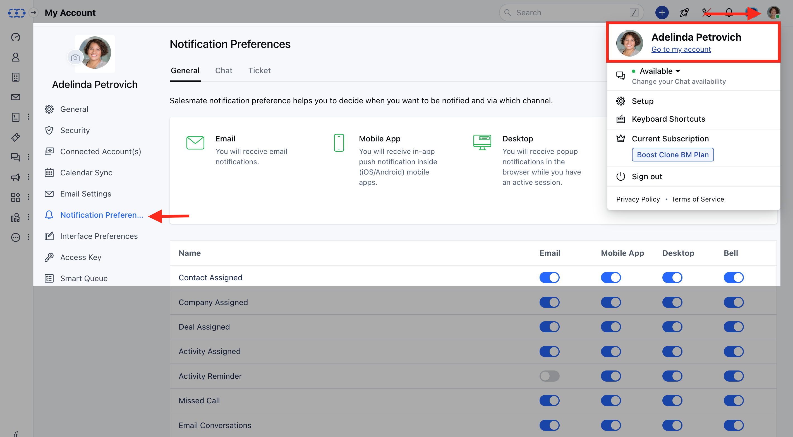
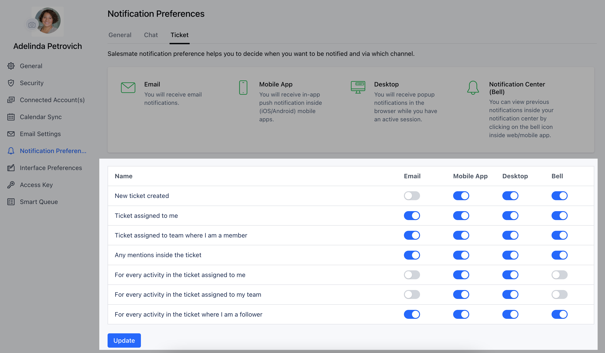

Ticket notifications are visible when the Ticket module is enabled on the link. You can choose which notifications should be received on your desktop, email and mobile

To Set the Ticket Notification,

*   Navigate to the **Profile Icon** on the top corner
*   Click on **Go To My Account**
*   Head over to the **Notification Preferences** 

*   Click on the **Tickets Section**
*   You can set the following preferences:
    *   **New ticket created:** You will be notified when a new ticket is created, and it is not assigned to anyone yet.
    *   **Ticket assigned to me:** You will be notified when a ticket is assigned to you.
    *   **Ticket assigned to the team where I am a membe**r - You will be notified when a ticket is assigned to your team.
    *   **Any mentions inside the ticket:** You will be notified when you are mentioned inside a ticket.
    *   **For every activity in the ticket assigned to me:** You will be notified for every reply/note posted in the ticket assigned to you.
    *   **For every activity in the ticket assigned to my team:** You will be notified for every reply/note posted in the ticket assigned to your team.
    *   **For every activity in the ticket where I am a follower:** You will be notified for every reply/note posted in the ticket where you have been added as a follower.
*   Once done, hit **Save** 

