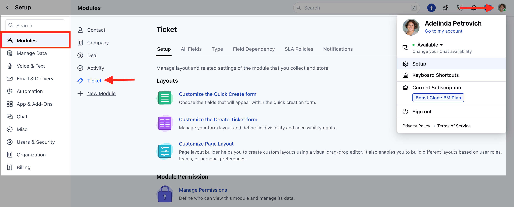
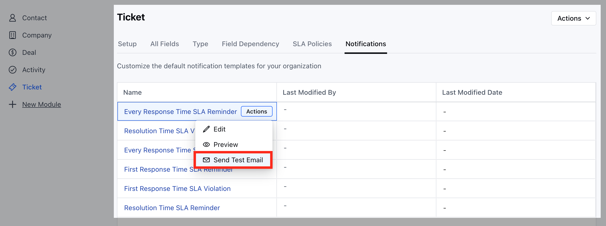
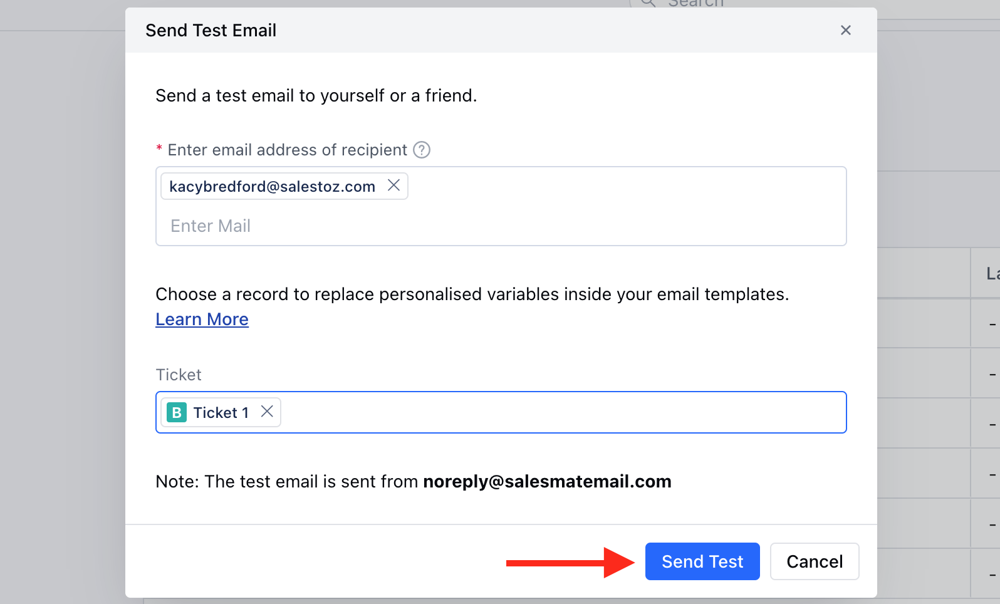

Once the Ticket Notification Templates are customized you can send the Test email to see how the email will appear and what information it will include.

<Note>
**Note:** Please note that this feature is only available on Paid plans
</Note>

To Send the Test Email for Ticket Notification Templates,

*   Navigate to the **Profile Icon** on the top right corner
*   Click on the **Set Up**
*   Head over to the **Modules** category
*   Click on the **Ticket** module

   
*   Head to the **Notifications** section
*   You will the List of the **Notification Templates**
*   Hover on the preferred  **Notification Template** and select the **Send Test Email** option under **Actions button.**

*   A pop will appear to enter the **Recipient** and the **Ticket** 
*   Once the information is added, click on **Send Test**

