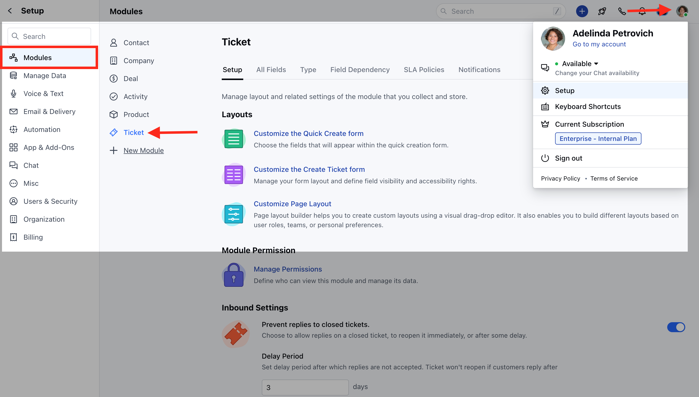
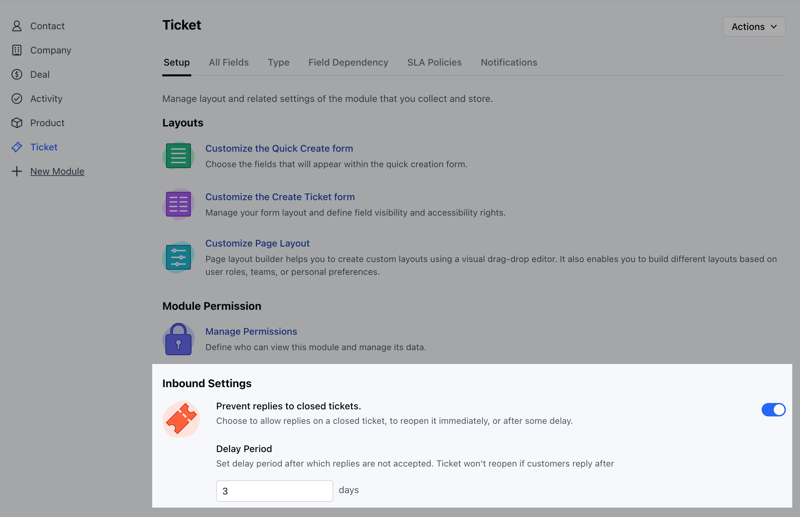

### **Can you edit a ticket priority field?

- No, you can’t edit the ticket priority field. They can be used with default values only. If you need further priorities, then you can create and use a custom field.

### **Can you delete a reply on the ticket? If yes, is there any specific permission for it?

- Yes, there is permission for deleting replies on a ticket, similar to chat. You can delete a reply from the ticket, and it does not affect the notifications that are sent.

### **How to Prevent Replies on Closed Tickets?

To Prevent Replies on Closed Tickets,

- Navigate to the **Profile Icon** on the top right corner
- Click on the **Set Up**
- Head over to the **Tickets** Module

* Under **Setup** section head to the **Inbound Settings** * Here configure the
following options * **Prevent Replies to the Closed Tickets:** Enable this
option to allow replies on a closed ticket, to reopen it immediately, or after
some delay. * **Delay Period:** Set delay period after which replies are not
accepted. Ticket won't reopen if customers reply after

