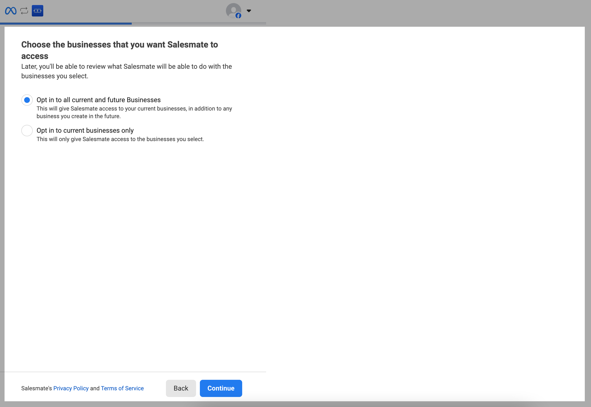
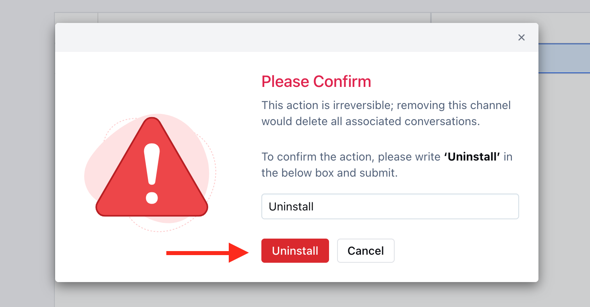

## Overview

**Facebook Messenger** is the key to connecting with billions of people across the world. Salesmate now allows you to integrate your Facebook Messenger with Salesmate establishing a two-way channel of communication with your customers, and reaching them where they communicate the most.

<Note>
  **Note**: Due to Facebook's policies, only business pages can be connected to third-party software (including Salesmate). It is not possible to integrate a personal page.
</Note>

## Prerequisites

Before setting up Facebook Messenger integration, ensure you have:

- **Facebook Business Page** with admin access
- **Active Unified Inbox subscription** in Salesmate
- **Page messaging enabled** on your Facebook page
- **Admin permissions** on the Facebook page you want to connect

## Topics Covered

- [How to Install Facebook Messenger](#how-to-install-facebook-messenger)
- [How the messages would appear in Salesmate](#how-the-messages-would-appear-in-salesmate)
- [How to Uninstall Facebook Messenger](#how-to-uninstall-facebook-messenger)
- [Facebook Message Delivery Window](#facebook-message-delivery-window)

## How to Install Facebook Messenger

<Steps>
  <Step title="Navigate to Chat Settings">
    1. Navigate to **Conversation Inbox** from the left menu bar
    2. Select **Chats**
    3. Click **Chat Settings** from the bottom left corner

    /

    5. Head to the **Channels** Option
    5. Click on the **"Add New Channel"**

    

    6. A popup will open up with available channel options; click the Install button for Facebook

    
  </Step>
</Steps>

Facebook Installation consists of 3 steps:

- [Connect](#connect)
- [Configure](#configure)
- [Channel Access](#channel-access)

## Connect

<Steps>
  <Step title="Connect to Facebook">
    1. Click on the **Connect to Facebook** option

    

    2. You will be redirected to the Facebook login page
    3. Enter your **Username and Password**

    
  </Step>
  <Step title="Select Business Access">
    1. Once logged in, you will be redirected to the screen to select the Businesses that you would like Salesmate to Access
    2. You can select one of the following options:
       - **Opt in to all current and future businesses** - Select this option if you wish to connect the current and future Businesses
       - **Opt in to current businesses only** - Select this option if you wish to connect only the current Businesses

    

    3. Once done click on **Continue**
  </Step>
  <Step title="Select Facebook Page">
    1. Now you will see the list of all Business pages accessible to you
    2. Select the Page to Connect with Salesmate

    

    3. Allow Salesmate the permission to access and hit on **Save**

    

    4. Once the information is saved, your account will then be connected successfully

    
  </Step>
</Steps>

<Note>
  **Note**: This Facebook account must have admin access to the pages you're trying to connect.
</Note>

## Configure

<Steps>
  <Step title="Configure Channel Settings">
    1. Once the Messenger is connected successfully, you will be redirected to the **Configure** screen
    2. Here, **Enable** the required Page and **Greeting** Message
    3. Then click on **Next**

    
  </Step>
</Steps>

## Channel Access

<Steps>
  <Step title="Set Channel Access Permissions">
    1. Once you configure the Messenger, you will be redirected to Channel Access screen
    2. Here, you can grant access to:
       - **Invite Everyone to Chat:** This will allow everyone with a chat license to respond to the channel's conversations

    

    - **Invite selected Users:** This will allow only the selected Users with a chat license to respond to the channel's conversations

    

    3. Once done click on **Finish**

    
  </Step>
</Steps>

## How the messages would appear in Salesmate

Upon completing the configuration, you will now be able to receive and manage the incoming chats from Facebook Messenger. These Chats would be visible under Conversation Inbox.

## How to Uninstall Facebook Messenger

<Steps>
  <Step title="Uninstall Facebook Messenger">
    1. Navigate to the **Conversations** **Icon** from the left menu bar
    2. Select **Chats**
    3. Click **Chat Settings** from the bottom left corner
    4. Head to the **Channels** Option
    5. Here select **Messenger** and click on the three dots available at the corner right

    

    6. Select **Uninstall**
    7. **Confirm** removing the Channel and click on **Uninstall**

    
  </Step>
</Steps>

<Note>
  **Note**: Please note that once you uninstall the Facebook Messenger Channel, all the associated conversations will get deleted. This is an irreversible process.
</Note>

## Facebook Message Delivery Window

- **Within 24 hours**
  - You can freely respond while the last message you received in the Conversation thread is less than 24 hours old. There are no limitations to the content or amount of replies that you can send. This means promotional content and automated bot replies are allowed.
- **24 hours to 7 days**
  - After 24 hours but within 7 days, your replies can only relate directly to the subject(s) of the conversation thread. Automated bot replies or promotional content are not allowed.

## Next Steps

After successfully setting up Facebook Messenger:

<CardGroup cols={2}>
  <Card title="Instagram Messenger" icon="instagram" href="/unified-inbox/sections/channels-installation/instagram-messenger">
    Connect Instagram Direct Messages to your unified inbox
  </Card>
  <Card title="WhatsApp Integration" icon="whatsapp" href="/unified-inbox/sections/channels-installation/whatsapp-twilio">
    Set up WhatsApp Business messaging
  </Card>
</CardGroup>