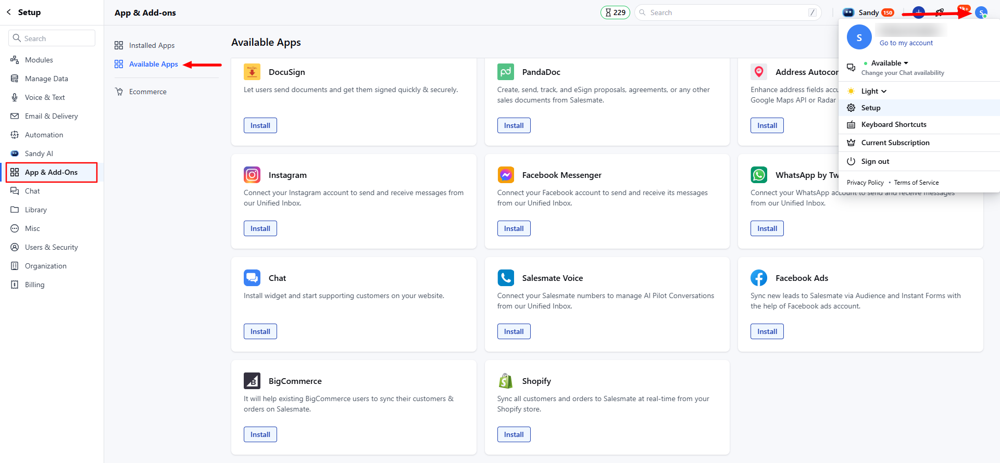
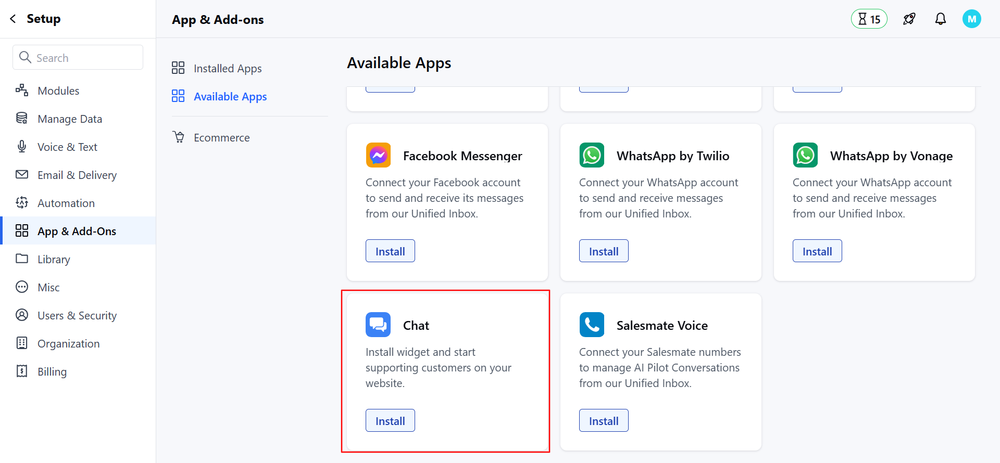
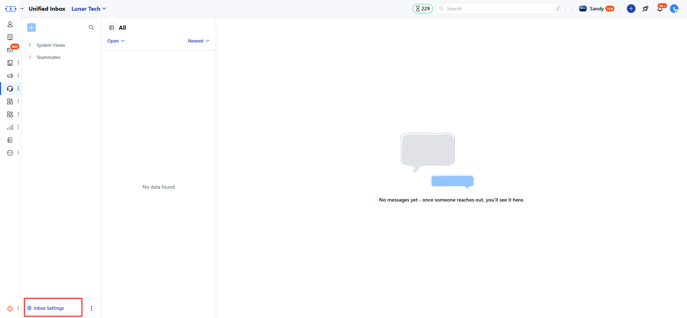
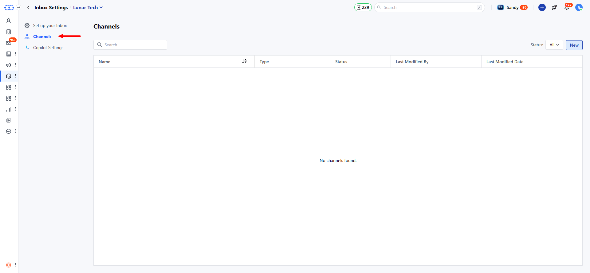
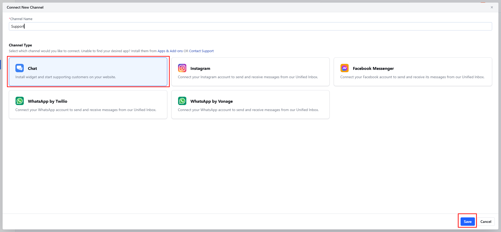
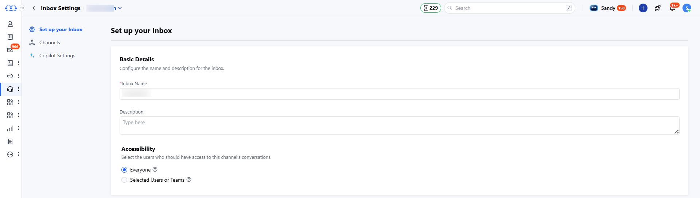
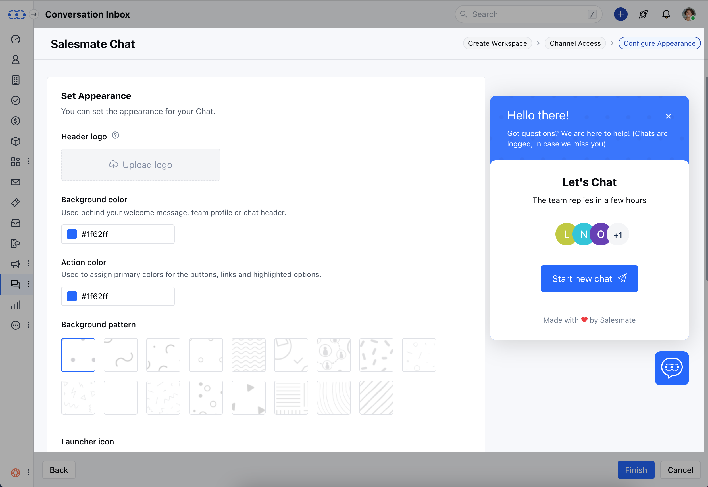
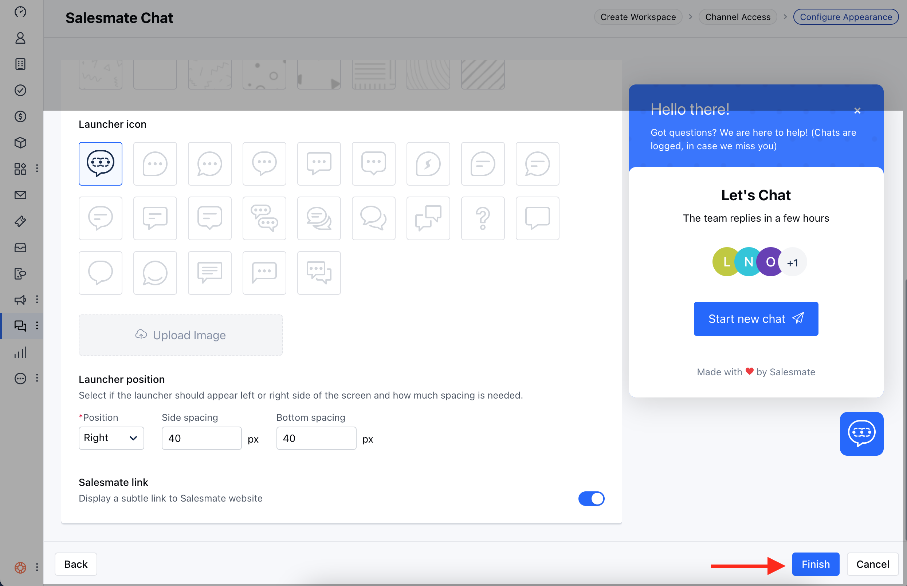

## Prerequisites

Before installing Salesmate Chat, ensure you have:

- **Admin access** to your website
- **Ability to add JavaScript code** to your website
- **Active Unified Inbox subscription**
- **Skara licenses** assigned to team members

## Installation Steps

<Steps>
  <Step title="To install Salesmate Chat">
    1. Navigate to the **Profile Icon** on the top right corner
    2. Click on **Set Up**
    2. Head over to the **Apps & Addons** category
    3. Click on **Available Apps**

    

  </Step>

  <Step title="Access Chat Settings">
    1. Navigate to the **Available App**
    2. Click on **Chats** option at the bottom and click on the **Install button**

    

    **or**
    1. Navigate to the Conversation Inbox icon from the left menu bar
    2. Head over to the **Inbox Settings** at the bottom left

   
  </Step>
  
  <Step title="Create Salesmate Chat Channels">
    1. Click on **Channels**
    2. Head to the **Add New Channel** option

       
    3. Select **Chat** and add a channel name
    4. Click on the **Save** option
    

  </Step>
  
 
</Steps>

## Create Workspace

<Steps>
  <Step title="Create Workspace">
    1. **Workspace name**: It will be visible to your website visitors when they start a conversation
    2. **Description**: Write your welcome message
    3. To adhere to the compliances you would need to accept the 
[Terms & Conditions](https://www.salesmate.io/tos/#establishing-an-account) and [Privacy Policy](https://www.salesmate.io/privacy-policy/#definitions)
    4. Select I agree to the "Terms & Conditions" and "Privacy Policy" option once you have read it
    5. Once done click on **Next**
       

  </Step>
  
 
</Steps>

## Channel Access

<Steps>
  <Step title="Channel Access">
    1. Here, you can grant access to, - **Invite Everyone to Chat**: This will
    allow everyone with a chat license to respond to the channel’s conversations
    - **Invite selected Users**: This will allow only the selected Users with a
    chat license to respond to the channel's conversations
  </Step>
</Steps>

## Configure Appearance

<Steps>
  <Step title="Set Appearance of the Chats widget which will appear on your website to the visitors">
    1. **Header Logo**: You can upload the header image which can be of **PNG, JPG,** or **GIF** type with a file dimension of 160pixels * 40pixels
    2. **Background Color**: Set the background color that will appear behind your welcome message, team profile, and chat header
    3. **Action Color**: Select the action color that will be used to assign primary colors for the buttons, links, and highlighted options
    4. **Background Pattern**: Select the background pattern from the given samples that will appear in the background of the background color you set

       
    5. **Launcher Icon**: Select the launcher icon that you want to display on the website
    6. **Launcher Position**: Select if the launcher should appear left or right side of the screen on your website and how much spacing is needed from the bottom and side
    7. **Salesmate Link**: Select to display the Salesmate link at the bottom of the launcher by turning the toggle On/Off
    8. Once done click on the **Finish** button
        

  </Step>
</Steps>
## Next Steps

After successfully installing Salesmate Chat:

<CardGroup cols={2}>
  <Card
    title="Configure Team Settings"
    icon="users"
    href="/unified-inbox/sections/manage-channels/team-setup"
  >
    Set up your team for efficient chat management
  </Card>
  <Card
    title="Add More Channels"
    icon="plus"
    href="/unified-inbox/sections/channels-installation/facebook-messenger"
  >
    Connect additional messaging platforms
  </Card>
</CardGroup>
