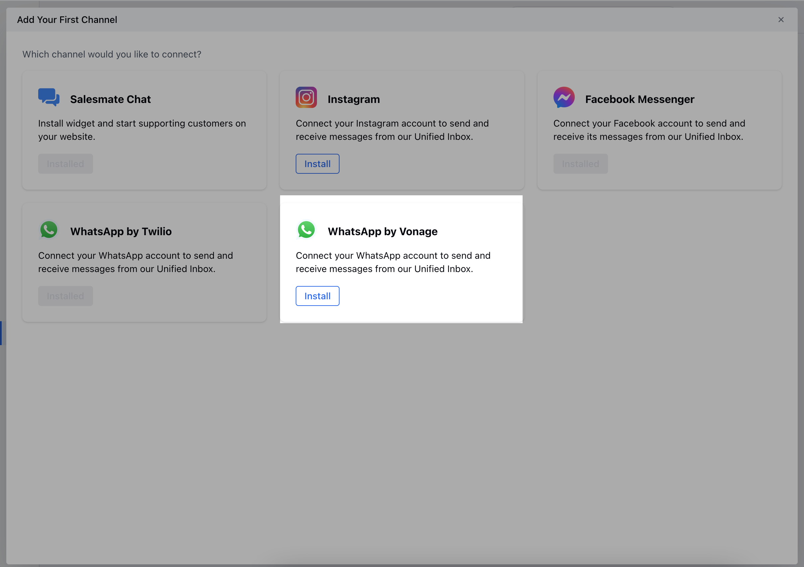
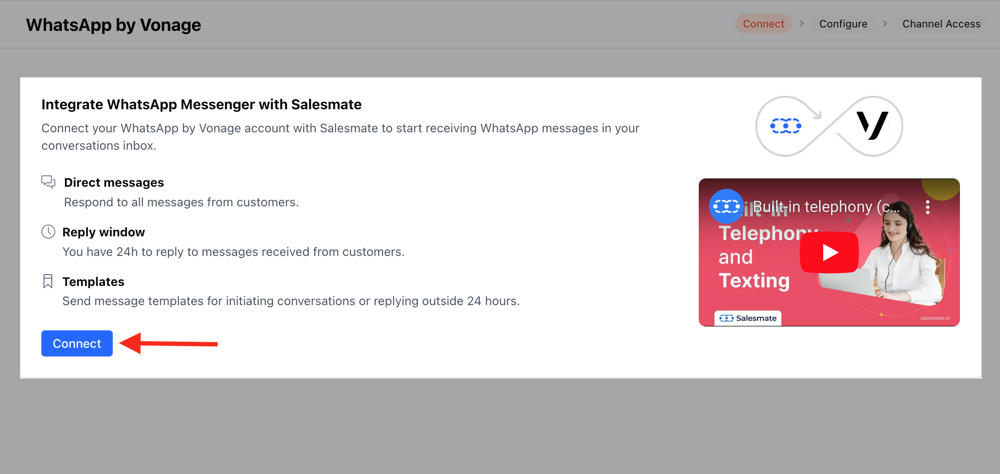

## Overview

**WhatsApp by Vonage** provides businesses with a comprehensive API solution, enabling seamless integration with the WhatsApp messaging platform\
Salesmate now allows integration with WhatsApp with Vonage for chat communication.

<Note>
**Note:**

- You must be registered to the **Vonage Paid Account** with **WhatsApp Sign Up** to Use **WhatsApp Via Vonage**. [Click here](https://developer.vonage.com/en/messages/concepts/whatsapp) to learn more about **Vonage WhatsApp Self-Sign-Up**.
- This integration is a part of the Salesmate Chat which requires the [Chat License](https://support.salesmate.io/hc/en-us/articles/360059697531-Salesmate-Chats-Licenses-and-Cost)

</Note>

## Prerequisites

Before setting up WhatsApp by Vonage integration, ensure you have:

- **Vonage Paid Account** with WhatsApp API access
- **WhatsApp Business Account** approved by Meta
- **Active Chat License** in Salesmate
- **Phone number verified** for WhatsApp Business use
- **Vonage API Key and Secret**

<Warning>
  You must be registered to the **Vonage Paid Account** with **WhatsApp Sign
  Up** to Use **WhatsApp Via Vonage**. [Learn more about Vonage WhatsApp
  Self-Sign-Up](https://developer.vonage.com/en/messages/concepts/whatsapp).
  This integration is a part of the Salesmate Chat which requires the [Chat
  License](https://support.salesmate.io/hc/en-us/articles/360059697531-Salesmate-Chats-Licenses-and-Cost).
</Warning>

## Installation Steps

<Steps>
  <Step title="Access Salesmate Channel Settings">
    1. Navigate to the **Conversations Icon** from the left menu bar
    2. Select **Chats**
    3. Click **Chat Settings** from the bottom left corner
    
    4. Head to the **Channels** Option
    5. Click on the "**Add New Channel**"

    

  </Step>

  <Step title="Select WhatsApp by Vonage">
    1. A popup will open up with available channel options
    
    2. Click the **Install** button for **WhatsApp by Vonage**

  </Step>

  <Step title="Connect Your Vonage Account">
    1. Click on **Connect** to begin the connection process
    
    2. **Enter the API Key** from your Vonage account
    3. **Enter the API Secret** from your Vonage account
    4. **Select WhatsApp Number** - As soon as you enter the API key and the API secret, the system will automatically show the list of registered numbers, from which you can select one number
    5. **Upload Private Key** - You need to download the private key from Vonage and upload here to move further

    

  </Step>

  <Step title="Configure Webhooks">
    1. Once you click on the **Next** option, you will be directed to the **Configure** screen
    2. **Copy the Webhook URL** from Salesmate
    3. On your **Vonage account** follow these steps:
       - Navigate to **Applications**
       - Search for **Salesmate**
       - Click on **Edit**
       - Under **Capabilities**, add this URL on the **Inbound URL** and **Status URL** field
    4. Click on **Next** to proceed

    

  </Step>

  <Step title="Set Channel Access">
    1. You will now be redirected to the **Channel Access** screen
    2. Choose your preferred access method:
       - **Invite Everyone to Chat:** This will allow everyone with a chat license to respond to the channel's conversations
    
       - **Invite selected Users:** This will allow only the selected Users with a chat license to respond to the channel's conversations
    
    3. Once done click on **Finish**

    

  </Step>
</Steps>

## Channel Configuration Options

### **Message Settings**

<AccordionGroup>
  <Accordion title="Webhook Configuration">
    **Configure webhook endpoints:**
    - **Inbound URL**: Receives incoming WhatsApp messages
    - **Status URL**: Receives message delivery status updates
    - **Application Settings**: Configure in Vonage dashboard under Applications
    - **Security**: Ensure webhook URLs are properly secured
  </Accordion>

{" "}

<Accordion title="Number Management">
  **Manage WhatsApp Business numbers:** - **Number Registration**: Register
  numbers through Vonage dashboard - **Number Verification**: Complete Meta
  verification process - **Multiple Numbers**: Support for multiple WhatsApp
  Business numbers - **Number Status**: Monitor number status and health
</Accordion>

  <Accordion title="Access Control">
    **Configure team access:**
    - **Everyone Access**: All chat license holders can respond
    - **Selected Users**: Restrict access to specific team members
    - **Permission Levels**: Configure different access levels
    - **Team Management**: Add or remove team members as needed
  </Accordion>
</AccordionGroup>

### **Vonage-Specific Features**

- **Global Messaging**: Support for international WhatsApp messaging
- **Rich Media Support**: Enhanced support for images, videos, and documents
- **Message Analytics**: Detailed conversation and performance analytics
- **API Integration**: Direct integration with Vonage's robust API
- **Enterprise Security**: Enterprise-grade security and compliance features

## Message Management

### **How WhatsApp Messages Appear in Salesmate**

Once the number is successfully connected, you will be able to receive and manage incoming chats from the connected WhatsApp numbers directly within Salesmate's conversation interface.

### **Message Features**

- **Real-time Messaging**: Instant message delivery and receipt
- **Rich Media Support**: Send and receive images, videos, documents
- **Message Status**: Track message delivery and read status
- **Conversation History**: Complete conversation history and context
- **Team Collaboration**: Multiple team members can collaborate on conversations

## Advanced Features

### **Conversation Analytics**

- **Message Volume Tracking**: Monitor incoming and outgoing message volumes
- **Response Time Analytics**: Track team response times and performance
- **Customer Engagement**: Measure customer engagement and satisfaction
- **Performance Metrics**: Detailed performance metrics and reporting

### **Integration Benefits**

- **Unified Inbox**: Manage all conversations from one central location
- **CRM Integration**: Seamless integration with Salesmate CRM features
- **Contact Management**: Automatic contact creation and management
- **Sales Pipeline**: Convert conversations into sales opportunities
- **Automation**: Automated workflows and responses

## Best Practices

<Tip>
  **Global Reach**: Vonage's global infrastructure ensures reliable message
  delivery worldwide. Take advantage of this for international customer support.
</Tip>

<Warning>
  **Compliance**: Ensure all messages comply with local regulations and WhatsApp
  policies. Vonage provides compliance tools to help maintain policy adherence.
</Warning>

### **Optimization Tips**

1. **API Management**: Regularly monitor your Vonage API usage and limits
2. **Number Health**: Keep your WhatsApp Business numbers in good standing
3. **Team Training**: Train your team on WhatsApp Business best practices
4. **Response Times**: Maintain quick response times for better customer satisfaction
5. **Security**: Regularly review and update webhook security settings

## Troubleshooting

### **Common Issues**

<AccordionGroup>
  <Accordion title="Connection Issues">
    **Possible solutions:** - Verify API Key and Secret are correct - Check if
    WhatsApp number is properly registered with Vonage - Ensure private key file
    is valid and uploaded correctly - Verify Vonage account has sufficient
    credits
  </Accordion>

{" "}

<Accordion title="Webhook Problems">
  **Check these items:** - Verify webhook URLs are correctly configured in
  Vonage dashboard - Ensure webhook endpoints are accessible and responding -
  Check for any firewall or security restrictions - Review webhook logs for
  error messages
</Accordion>

  <Accordion title="Message Delivery Issues">
    **Troubleshooting steps:** - Check WhatsApp Business account status - Verify
    number is not blocked or restricted - Review message delivery reports in
    Vonage dashboard - Ensure compliance with WhatsApp messaging policies
  </Accordion>
</AccordionGroup>

## Uninstalling WhatsApp by Vonage

If you need to remove the WhatsApp by Vonage integration:

1. Navigate to the **Conversations Icon** from the left menu bar
2. Select **Chats**
3. Click **Chat Settings** from the bottom left corner
4. Head to the **Channels** Option
5. Select **WhatsApp by Vonage** and click on the three dots available at the corner right
6. Select **Uninstall**
7. **Confirm** removing the Channel and click on **Uninstall**

## Next Steps

After successfully setting up WhatsApp by Vonage:

<CardGroup cols={2}>
  <Card
    title="Manage Channel Access"
    icon="users"
    href="/unified-inbox/sections/manage-channels/channel-access"
  >
    Configure team access and permissions
  </Card>
  <Card
    title="WhatsApp Message Templates"
    icon="template"
    href="/unified-inbox/sections/whatsapp-message-templates/create-template"
  >
    Create and manage WhatsApp message templates
  </Card>
</CardGroup>
