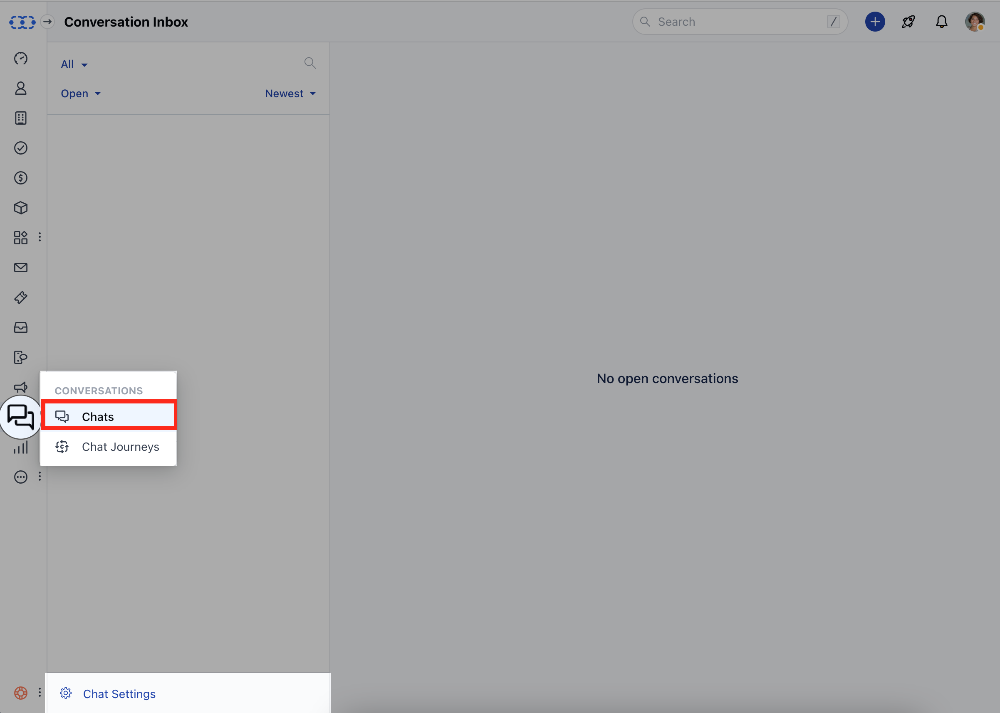
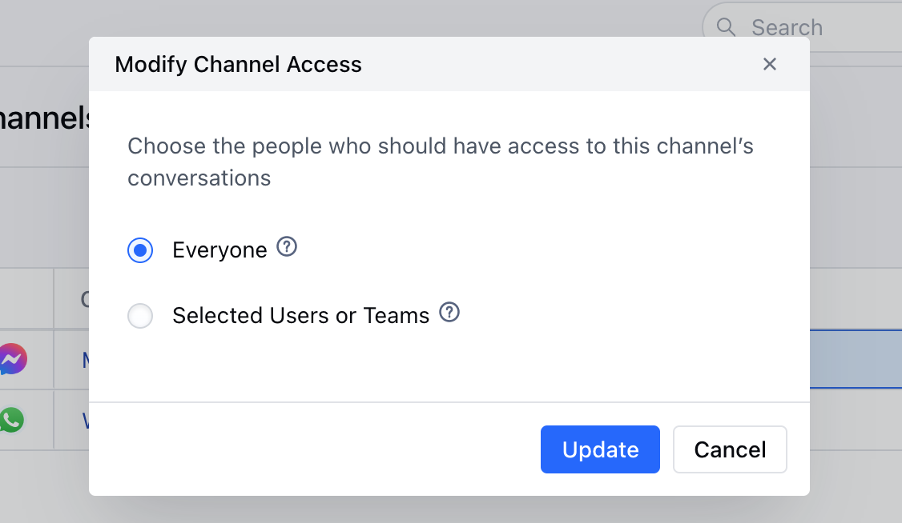
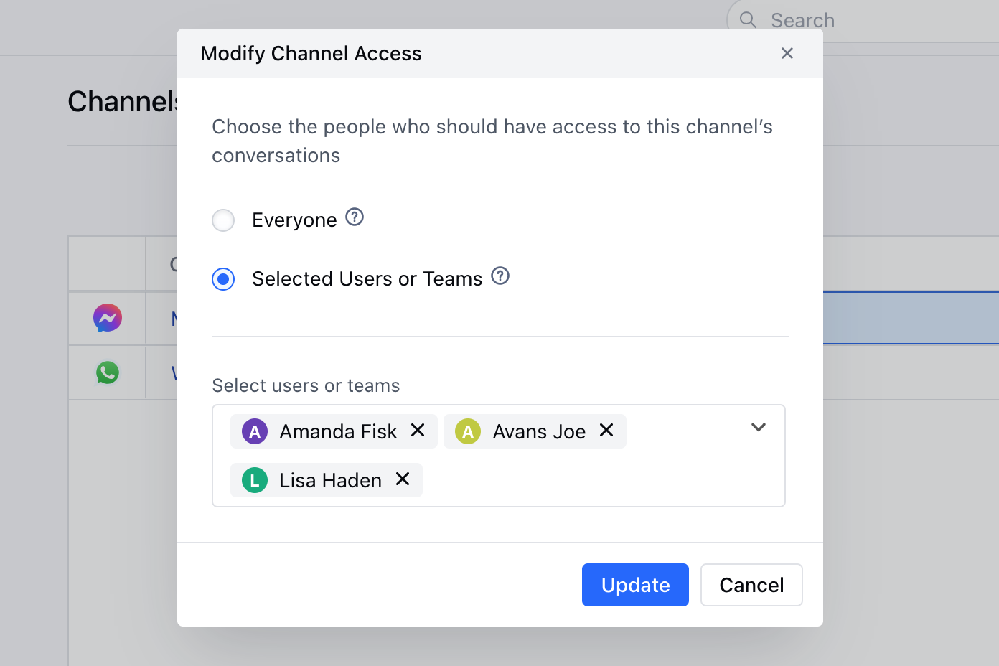
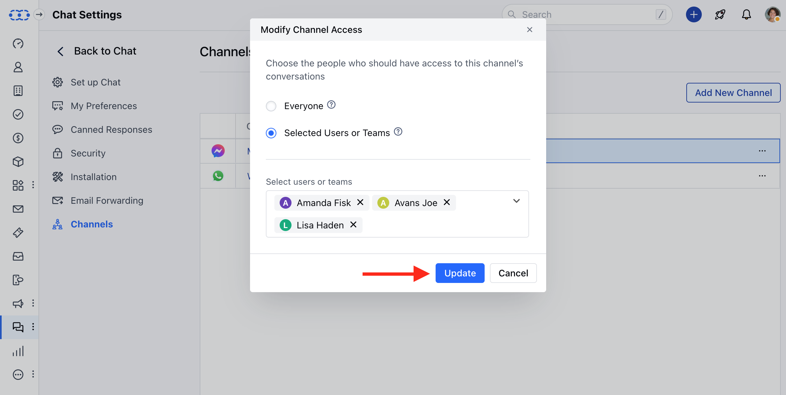

## Prerequisites

Before managing channel access, ensure you have:

- **Admin or Manager permissions** in Salesmate
- **Active Unified Inbox subscription**
- **Configured channels** that need access management
- **Team members added** to your Salesmate account
- **Clear understanding** of your team's roles and responsibilities

## Access Management Overview

### **Permission Levels**

<CardGroup cols={3}>
  <Card title="View Only" icon="eye">
    Can view conversations but cannot respond or make changes
  </Card>
  <Card title="Respond" icon="reply">
    Can view and respond to conversations but cannot modify settings
  </Card>
  <Card title="Manage" icon="gear">
    Full access including settings, templates, and channel configuration
  </Card>
</CardGroup>

## Managing Channel Access

<Steps>
  <Step title="Access Channel Management">
    1. Navigate to the **Conversation Icon** from the left menu bar
    2. Select **Chats**
    3. Click **Chat Settings** from the bottom left corner

    
    4. Head to the **Channels** Option
    5. Click on the **three dots** available at the corner right of the Channel
    6. Select **Channel Access**

    

    7. Here, you can choose to allow Access to
        - **Everyone**: Select this option to let Everyone with the Chat License respond to the Channel's conversation
    

    8. **Selected Users or Teams**:  Select this option to allow selected Users or the Teams with the Chat License to respond to the Channel's conversation
    

    9. Once done, **Update** the Access
    

  </Step>

</Steps>
## Next Steps

After configuring channel access:

<CardGroup cols={2}>
  <Card
    title="Team Training"
    icon="graduation-cap"
    href="/unified-inbox/sections/manage-channels/team-training"
  >
    Train your team on using their assigned channels effectively
  </Card>
  <Card
    title="Performance Monitoring"
    icon="chart-line"
    href="/unified-inbox/sections/manage-channels/performance-monitoring"
  >
    Set up monitoring and analytics for team performance
  </Card>
</CardGroup>
