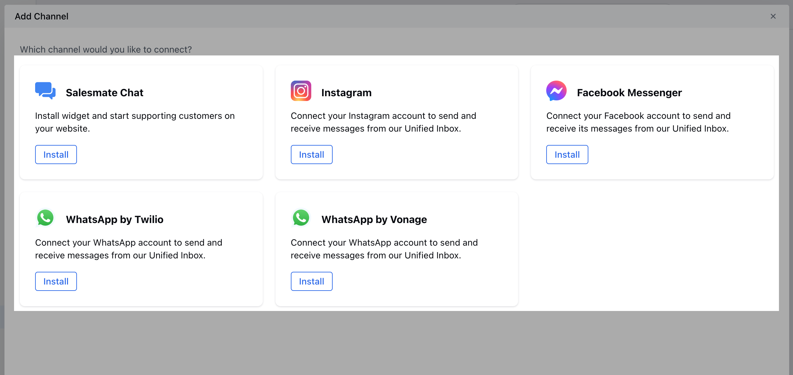

<Warning>
  Please Note that Unified Conversation Inbox is an add-on feature. It is priced
  at **`$15` per user per month** or **`$144` per user per year** (**`$12`
  effective monthly**). WhatsApp, Facebook, Instagram & Chats is a part of our
  Conversation Inbox add-on
</Warning>
## Topics Covered

- [How to Activate the Unified Conversation Inbox](#activation-steps)
- [How to Add Your First Channel](#how-to-add-your-first-channel)

## Activation Steps

Step-by-step guide to enable the Unified Inbox feature in your Salesmate account.\
Follow these steps to activate the Unified Conversation Inbox:

<Steps>

  <Step title="To Activate the Unified Conversation Inbox,">
    1. Navigate to the **Profile Icon** on the top right corner
    2. Click on **Set Up** or **Account Settings**
    2. Head over to the **Apps & Addons** category
    3. Click on **Available Apps** or **Add-ons**

    

  </Step>
  
  <Step title="Subscribe to Unified Inbox">
    1. Look for **Add-ons** or **Premium Features** section
    2. Find **Unified Conversation Inbox**
    3. Click **Activate Now**
    4. Complete the billing setup if required

    

  </Step>
  
</Steps>
### Alternative Method
<Steps>
  <Step title="Access Conversation Inbox">
    1. Navigate to the **Conversation Inbox Icon** from the left sidebar
    2. Click on **Chats**
    3. You will be redirected to the Page with an option to **Activate Now**
    4. Click on this option to continue Activating the **Unified Conversation Inbox**

    

  </Step>
</Steps>
## How to Add Your First Channel
<Steps>
  <Step title="Add Your First Channel">
    1. Once you have Activated the Conversation Inbox you now get an option to **Add Your First Channel**

    
    2. As you click on this option, you will be redirected to a centralized page with the list of installable channels
    3. Select the Channel, click on the Install option for the Channel that you wish to be installed
    

  </Step>
</Steps>
## Next Steps

Once activated, you can:

<CardGroup cols={2}>
  <Card
    title="Connect Channels"
    icon="plug"
    href="/unified-inbox/sections/channels-installation/salesmate-chats"
  >
    Set up your messaging platforms and social media channels
  </Card>
  <Card
    title="Configure Settings"
    icon="gear"
    href="/unified-inbox/configuration"
  >
    Customize your Unified Inbox preferences and workflows
  </Card>
</CardGroup>
