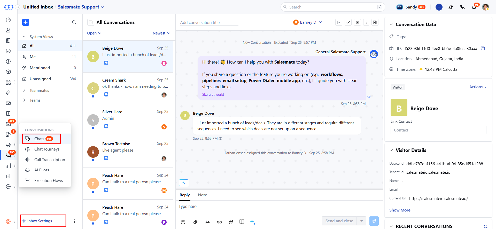
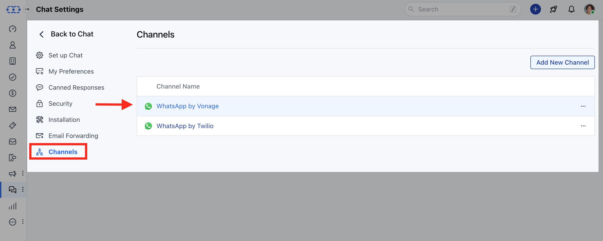
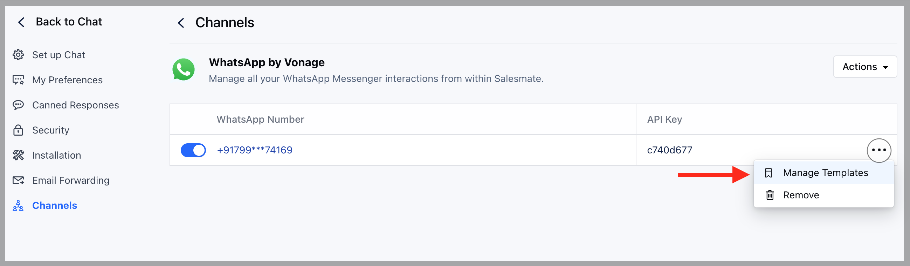
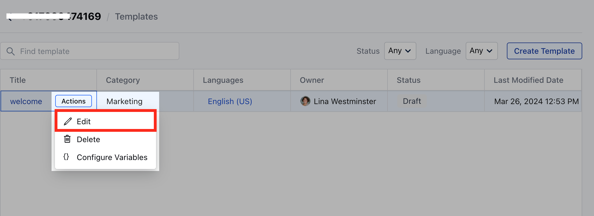
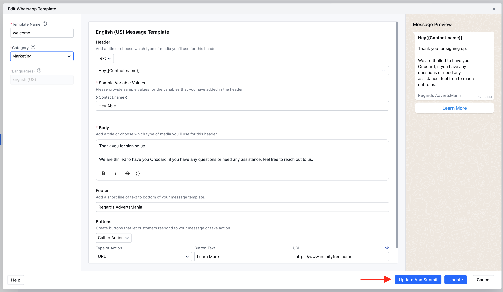

## Overview

Once the Template is created, if you require any changes in the message templates, then you can edit it and submit for the review.

<Note>**Note:** The templates with a **‘Draft’** status can be edited.</Note>

## Editing Process

<Steps>
  <Step title="Access Conversation Inbox">
    Navigate to the **Conversation Inbox** Icon from the left menu bar
  </Step>

  <Step title="Navigate to Inbox Settings">
    1. Click on **Chats**
    2. Head over to the **Inbox Settings**

    

  </Step>

  <Step title="Access WhatsApp Channel">
    1. Click on the **Channels**
    2. Head to the **Connected Channels** and click on the preferred **WhatsApp channel**

    

  </Step>

  <Step title="Manage Templates">
    1. Select the number and click on the three dots
    2. Select **Manage Template** option

    

  </Step>

  <Step title="Edit Template">
    Hover over the template that you want to edit and choose the **Edit** option in the **Actions.**

    

  </Step>

  <Step title="Update and Submit">
    1. Make the required changes and click on the **“Update and Submit”** button to apply changes.

    

    2. The template will then be submitted for review, and once it is approved you will be able to use it.

  </Step>
</Steps>
## Next Steps

After creating your WhatsApp template:

<CardGroup cols={2}>
  <Card
    title="Create New Templates"
    icon="plus-square"
    href="/unified-inbox/sections/whatsapp-message-templates/create-template"
  >
    Create new WhatsApp templates with dynamic variables
  </Card>
  <Card
    title="Send Template Messages"
    icon="paper-plane"
    href="/unified-inbox/sections/whatsapp-message-templates/send-template"
  >
    Learn how to send messages using your approved templates
  </Card>
</CardGroup>
