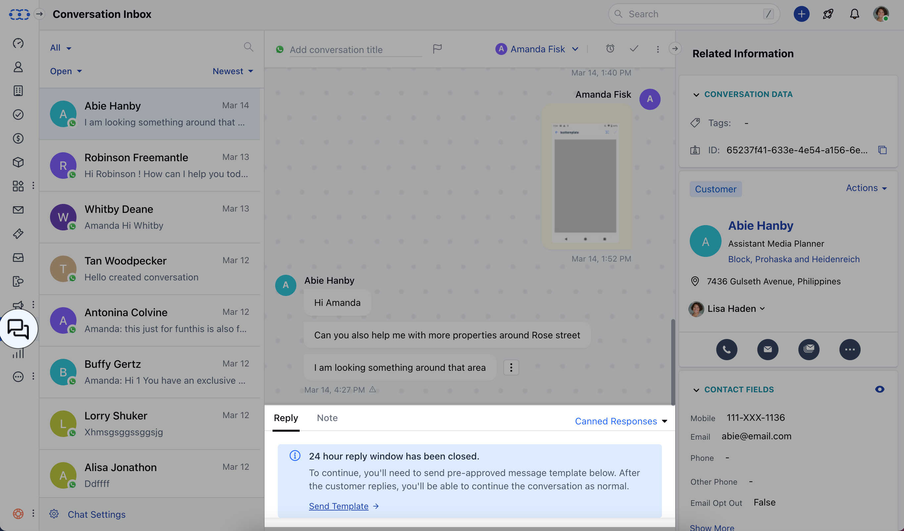
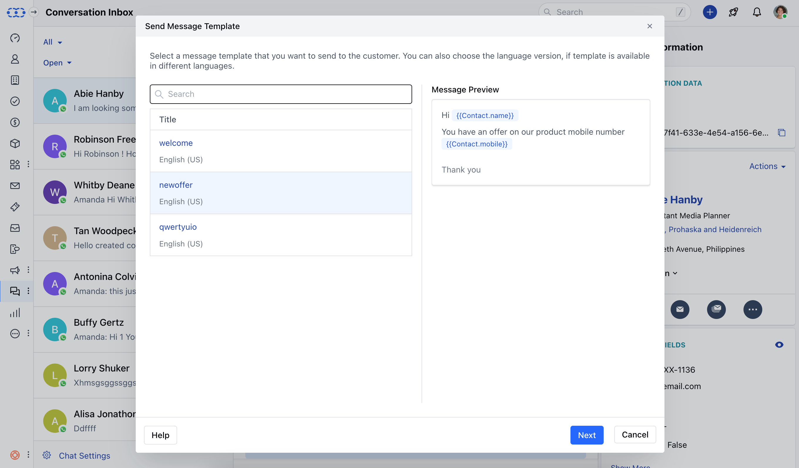
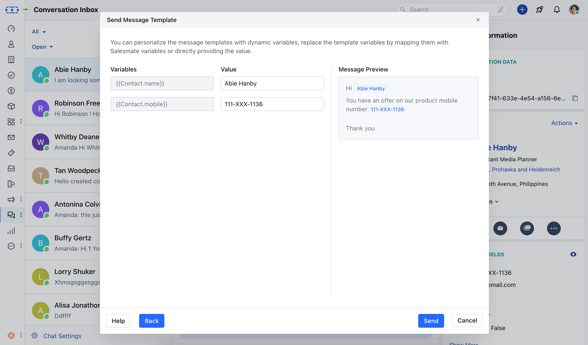

## Overview

When you want to initiate a conversation with your customer or reply to their conversation after the reply window is closed.

## How to Send WhatsApp Templates

<Steps>
  <Step title="Template Approval and Navigation">
    1. Once a template has been approved, it can be used to send messages in conversations.

    2. Navigate to the conversation where you wish to send a reply.

    3. If the reply window for that conversation has been closed, a message will appear in the text editor stating **"24-hour reply window has been closed,"** along with a button labeled **"Send Template."**

    4. You can also send message template in an ongoing WhatsApp conversation, by clicking on the icon **'Message Template'** next to insert link icon in the editor.

  </Step>

  <Step title="Select Template">
    1. Click on **Send Template**

    2. A pop will open to select the Template, choose the template you wish to send and click on **Next**

    

  </Step>

  <Step title="Personalize and Send">
    1. You have the option to personalize message templates using dynamic variables. These variables can be replaced by mapping them with Salesmate variables or by directly providing the corresponding values.

    2. Once done click on **Send**

    3. If the template doesn't contain any variables then you will get the **"Send"** button to send this template in the conversation.

    

  </Step>
</Steps>
## Next Steps

After deleting your WhatsApp templates, you might want to:

<CardGroup cols={2}>
  <Card
    title="Create New Templates"
    icon="plus"
    href="/unified-inbox/sections/whatsapp-message-templates/create-template"
  >
    Create new WhatsApp message templates for your business needs
  </Card>
  <Card
    title="Manage Templates"
    icon="gear"
    href="/unified-inbox/sections/whatsapp-message-templates/template-variables"
  >
    Learn more about managing your WhatsApp message templates
  </Card>
</CardGroup>
