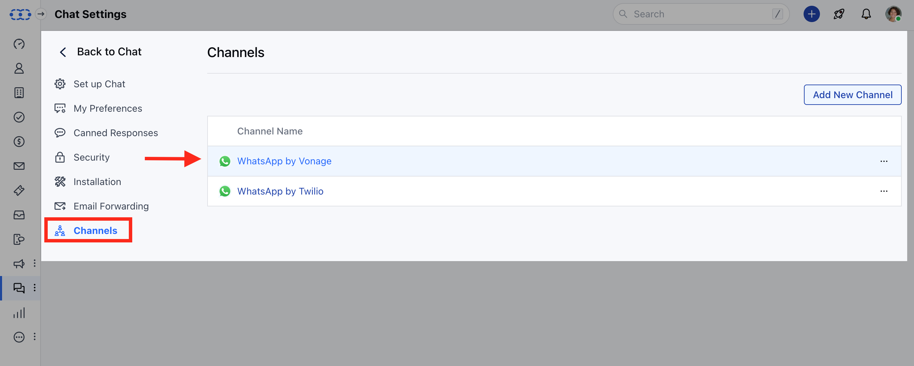

## Overview

WhatsApp template variables are dynamic placeholders within message templates that get replaced with specific information when the template is used. Configuring these variables allows you to personalize messages with contact details, deal information, company data, and other relevant information from your Salesmate CRM.

## Prerequisites

Before configuring WhatsApp template variables, ensure you have:

- **Active WhatsApp Business API** account connected to Salesmate
- **Unified Inbox subscription** with WhatsApp integration
- **Approved WhatsApp templates** with variables defined
- **Template management permissions** in your Salesmate account
- **Understanding of Salesmate data fields** (Contact, Company, Deal, Owner)

<Warning>
  Variables can only be mapped to Salesmate data fields. External data sources
  are not supported for template variable configuration.
</Warning>

## Variable Types

### **Available Data Sources**

<CardGroup cols={4}>
  <Card title="Contact" icon="user">
    **Contact information:** - Name and personal details - Phone and email -
    Custom contact fields - Contact preferences
  </Card>
  <Card title="Company" icon="building">
    **Company details:** - Company name and info - Industry and size - Custom
    company fields - Company preferences
  </Card>
  <Card title="Deal" icon="handshake">
    **Deal information:** - Deal name and value - Stage and pipeline - Custom
    deal fields - Deal timeline
  </Card>
  <Card title="Owner" icon="crown">
    **Owner details:** - Agent name and info - Contact information - Department
    details - Custom owner fields
  </Card>
</CardGroup>

## Configuring Variables

<Steps>
  <Step title="Access Conversation Inbox">
    1. Navigate to **Conversation Inbox** from the left menu bar
    2. Click on **Chats** in the inbox interface
    3. Head over to **Chat Settings** to access configuration options

    

  </Step>

  <Step title="Navigate to WhatsApp Channel">
    1. Click on **Channels** in the settings menu
    2. Go to **Connected Channels** section
    3. Click on your preferred **WhatsApp channel** from the list

    

  </Step>

  <Step title="Access Template Management">
    1. **Select the phone number** associated with your WhatsApp channel
    2. **Click on the three dots** (action menu) next to the number
    3. **Select "Manage Template"** option from the dropdown menu

    
    4. You will be directed to a screen where you will see the templates of this number.
    5. Click on Create Template option to create a new template

  </Step>

  <Step title="Open Variable Configuration">
    1. **Hover over the template** you want to configure
    2. **Choose "Configure Variables"** from the action menu
    3. A **configuration popup** will appear with variable options

    

  </Step>

  <Step title="Map Variables to Data Fields">
    1. **Review default variables** displayed in the popup
    2. **Click on the Variable Icon** to open field mapping options
    3. **Select data source** (Contact, Company, Deal, or Owner)
    4. **Choose specific field** from the selected data source
    5. **Preview the template** with mapped variables
    6. **Click Save** to apply the configuration

    
    

  </Step>
</Steps>
<Note>
**Note:** 

- The system will fetch the latest open deal associated with the contact, and show its details (if it exists).
- In case of fetching company data, the priority will be given to the company associated with the contact, and if not found then will fetch company details associated with the deal ( if exists, else empty data).
- You can only provide Salesmate variables here

</Note>

## Next Steps

After configuring your WhatsApp template variables:

<CardGroup cols={2}>
  <Card
    title="Send Template Messages"
    icon="paper-plane"
    href="/unified-inbox/sections/whatsapp-message-templates/send-template"
  >
    Learn how to send personalized messages using your configured templates
  </Card>
  <Card
    title="Create New Templates"
    icon="plus-square"
    href="/unified-inbox/sections/whatsapp-message-templates/create-template"
  >
    Create new WhatsApp templates with dynamic variables
  </Card>
</CardGroup>
